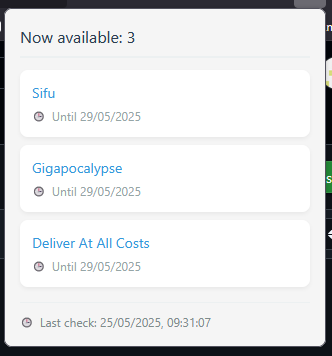

# Epic Games Free Monitor 🎮  

  
  

A browser extension that automatically tracks and notifies about free game promotions in the Epic Games Store.  

  

## Features ✨  
- 🔔 Desktop notifications for new free games  
- 🕒 24-hour automatic checks  
- 📅 Expiration date tracking  
- 🎯 Direct store links  
- 🌍 English localization  
- 📦 Lightweight (under 100KB)  

## Installation 📦  
### Firefox Users  
[Install from Mozilla Add-ons](https://addons.mozilla.org/firefox/addon/epic-games-free-monitor/)  

### Manual Installation  
1. Download the latest release from [Releases](https://github.com/stanleyandroid/epic-games-free-monitor/releases)  
2. Open `about:debugging` in Firefox  
3. Click "Load Temporary Add-on"  
4. Select `manifest.json` from the extracted folder  

## Development 🛠️  
1. Clone the repository:  
   `git clone https://github.com/stanleyandroid/epic-games-free-monitor.git`  
2. Install dependencies:  
   `npm install`  
3. Run locally:  
   `web-ext run`  

## Contributing 🤝  
We welcome contributions! Here’s how to help:  
1. **Fork** the [repository](https://github.com/stanleyandroid/epic-games-free-monitor)  
2. **Create a feature branch**:  
   `git checkout -b feature/your-feature-name`  
3. **Commit changes**:  
   `git commit -m "feat: describe your changes"`  
4. **Push to the branch**:  
   `git push origin feature/your-feature-name`  
5. **Open a Pull Request** with a clear description  

## License 📄  
Distributed under the MIT License.  
See [LICENSE](LICENSE) for details.  

---  

❤️ **Special Dedication**  
This project is lovingly dedicated to my daughter, whose curiosity for technology inspired its creation,  
and to my friends Anton Zorin and Konstantin Popov, for moral supporting.  

⭐ **Support the project** by starring the [repository](https://github.com/stanleyandroid/epic-games-free-monitor)!  
